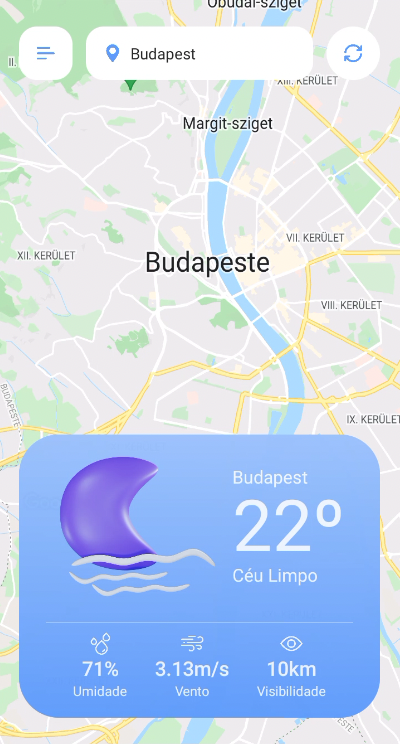
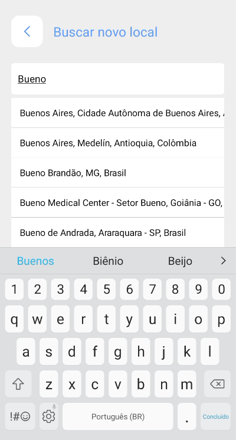
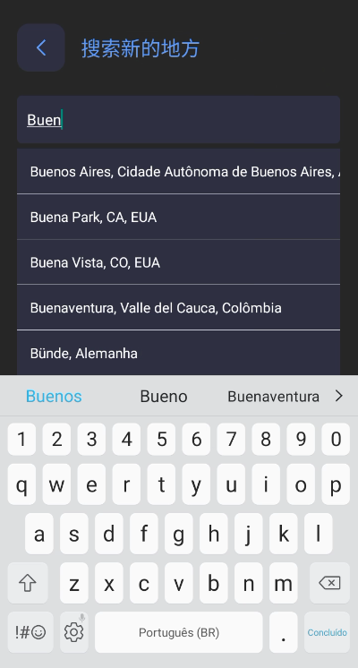

# About the project

This app was developed for a position at Builders using React Native (with React Native CLI), consuming data from [Open Weather API](https://openweathermap.org/) and [Google Places API](https://developers.google.com/maps/documentation/places/web-service/overview).

---

## Application summary
The app fetches weather information around the world and shows them in a friendly user interface. Initially, the app consumes the user's location (if permission is granted) and gets local weather. Later the user can navigate through the map or search for new places, while the app gets new information. There are some settings that the user can change, such as language, units, and theme, as shown below.

### ▶️ Video of the app being used

[https://www.youtube.com/watch?v=UxHzZpVsBWA](https://www.youtube.com/watch?v=UxHzZpVsBWA)

---

## Some features

### 🎨  Themes

Both light and dark themes were created, allowing the user to change it manually or based on the system.

### 🌓  Day and night icons

The weather icons change between day and night pack based on timezone, sunrise, and sunset data received from the API.

### 🔎 Search

The search page has an autocomplete field that fetches data from Google Places API and navigates the user to the newly selected location.

### 🌎  Translation and units

The user can change the entire app language (there are 6 languages available), and units to see the weather data in metric or imperial.

---

## Some of the libraries used

- **react-redux** (Used for global state management)
- **redux-persist** (Used to persist store data when reopening the app)
- **@react-native-community/async-storage** (Used for saving and retrieving data)
- **react-native-geolocation-service** (Used to get user's GPS position)
- **react-native-google-places-autocomplete** (Used to search places around the world)
- **react-native-maps** (Used to show and navigate through the Google Maps natively)
- **@react-navigation/native** (Used for screens navigation)
- **react-native-select-dropdown** (Used to create custom selects in the settings screen)
- **styled-components** (Used for styling with CSS syntax)
- **react-content-loader** (Used to draw skeletons loaders)
- **react-native-svg** (Used to easily handle SVG vectors)

You may find more information on the libraries used in `package.json`.

---

## How to run the project

Setup your environment following the official [documentation](https://reactnative.dev/docs/environment-setup).

Use [Yarn](https://yarnpkg.com/) or change the commands below accordingly if you prefer to use [NPM](https://www.npmjs.com/).

#### Packages and Libraries

Access the root directory and run the following command:

> yarn install

Check if there is a device or emulator connected using adb command:

> adb devices

#### React Native Command Line Interface

React Native has a built-in command-line interface. Rather than install and manage a specific version of the CLI globally, we recommend you access the current version at runtime using npx, which ships with Node.js. With npx react-native <command>, the current stable version of the CLI will be downloaded and executed at the time the command is run.

#### Running the application on Android

> npx react-native run-android

#### Running the application on iOS

> npx react-native run-ios

For further information, please access [React Native's documentation page](https://archive.reactnative.dev/docs/getting-started).

If you can't get this to work, see the [Troubleshooting page](https://reactnative.dev/docs/troubleshooting).

---

## Roadmap

#### Tests

The application uses some libraries and APIs that require additional code or mocks configuration to work (Open Weather API, Google Places API, React Navigation, Redux, AsyncStorage, for example), so the next step would be to work on the settings and mockups to test the app.

#### Custom font

The UI could be improved by integrating a custom font that would have a better fit for the current visual.

#### Additionally features

Due to different APIs, the name of the cities searched from Google Places API may differ from the city name returning from Open Weather Map API being shown in the widget. In a future implementation, I would pass the city name searched by navigation parameter and use it on the main screen.

